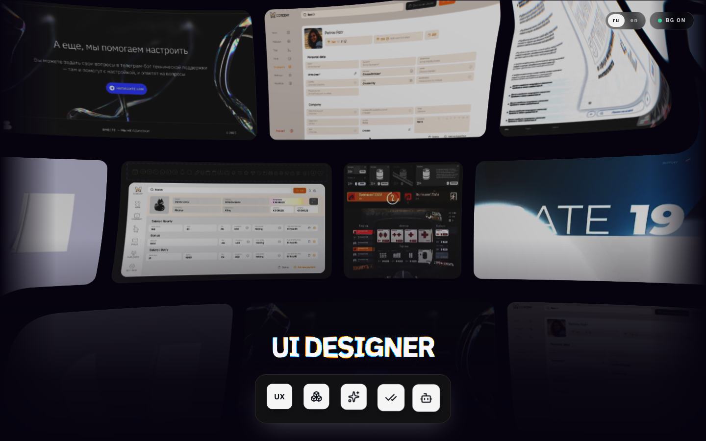
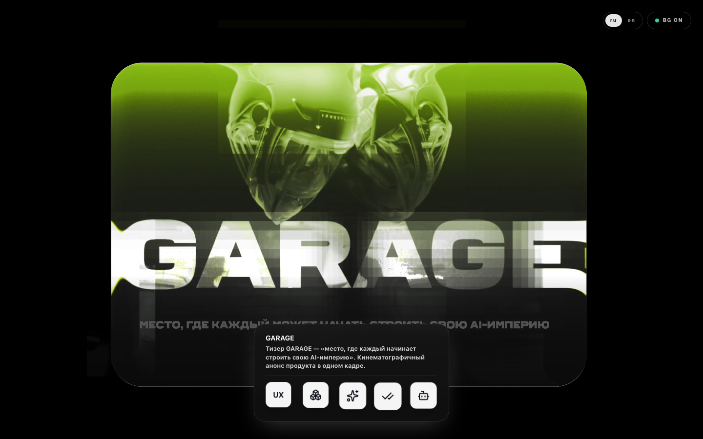
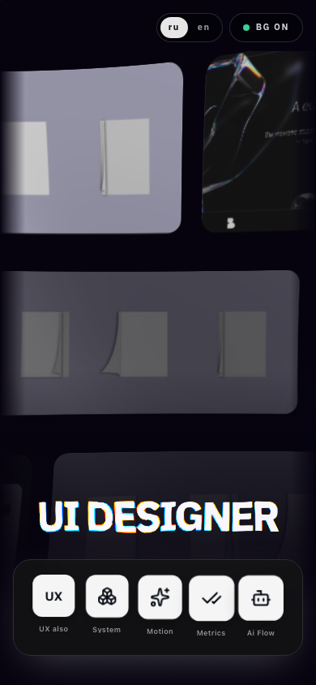

# UI Design: portfolio landing

A WebGL portfolio landing page: animated headline, magnetic dock, and a
full-screen gallery built around real project work.



**Live demo:** https://olezhapth2.github.io/ui-design/

## What's inside

- Animated **headline** with glyph scramble and distortion (ogl)
- **Magnetic dock**: icons follow the cursor on a spring, labels move with
  them, warm tooltips on hover and keyboard focus
- **Gallery background** (three.js): three drifting rows of cards, hover lens
  with chromatic dispersion, per-card highlight, gallery swap on dock click
- **Full-screen viewer** streaming HD originals (native-resolution videos and
  screenshots, not thumbnails), soft gradient under the dock
- **Info panel** with project name or clean external link and RU/EN captions
- **RU / EN switch**: captions, profile panel, `document.title` and
  `<html lang>` all follow
- **Performance minded**: device-pixel-ratio cap, 30 fps background,
  24 fps textures, lighter card alpha, mobile layout



## Stack

React 19 · Vite 5 · Tailwind 3 · three (gallery) · ogl (headline) ·
motion (tooltips) · ESLint

## Run

```bash
npm install
npm run dev      # http://localhost:8080
npm run build    # dist/
npm run lint
```

## Structure

```
src/
  WarpPage.jsx         page: layout, i18n, panels, fullscreen viewer
  WarpText.jsx         animated WebGL headline
  components/
    MagneticDock.jsx   magnetic dock with tracked labels
    gallery/           three.js rows, lens, texture pipeline
    warm-tooltip.jsx   tooltips
  data/
    clips.js           gallery cards: src, iw/ih, hd sources
    captions.js        RU/EN caption per card
public/
  motion/<gallery>/    media: mp4/jpg + .hd originals
  Oleg-Devyatov-CV-*    CV PDFs ("Download CV")
screenshots/           README images
```

## Media

All gallery media is original work: screen recordings, UI screenshots and
motion clips. The full-screen viewer loads `.hd.*` variants at native
resolution; the background grid uses the lighter versions and never upscales.


